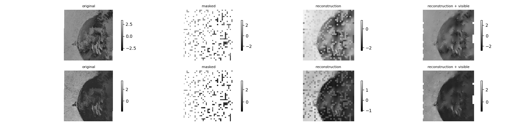

# AI4arctic readme

This repo is built on top of [MMSelfsup](https://github.com/open-mmlab/mmselfsup), a self-supervised representation learning toolbox based on PyTorch. This repo is particularly useful for building foundation models as all the known methods are implemented. However the REPO is designed for General computer vision task and  not for remote sensing or other data. This repo contains the code to use Remote sensing data for self supervised pretraining. 

For Finetuning tasks, please use the [sea-ice-mmseg](https://github.com/Fernando961226/sea-ice-mmseg) which is specially adapted for segmentation tasks.

#### Key enhancements

- Add a dataloader for loading images from NetCDF(.nc) file 
- Support the MAE architecture to allow variable number of input channels contrast to RGB data with only 3 channels
- MAE Reconstruction visualization: Plot each channel individually as opposed to RGB channels


## Getting Started:

### Installation
Install the required packages and dependencies by running
```linux
bash compute_canada/submit/create_env.sh <env_name>
```
This will create a virtualenv at the location \~/<env_name>. (\~ stands for root/home folder)

### Creating config file

OpenMMLAB uses config file based experiments. This is very useful in Deep learning experiments where there are 100's of parameters and only few change at a time. Check out [this documentation](https://mmengine.readthedocs.io/en/latest/advanced_tutorials/config.html) for more information.

An example config file for Downsampling 10x and Mask ratio=75% is given at [configs/selfsup/ai4arctic/mae_ai4arctic_ds10_pt_80_ft_20.py](configs/selfsup/ai4arctic/mae_ai4arctic_ds10_pt_80_ft_20.py)

### Submitting a job

To enable submitting multiple jobs easier on slurm (especially when the user wants to test different configurations), a shell script is created where the user only has to put the path of the config files in a list and they all are submitted.

```Shell
#!/bin/bash 
set -e
mmselfsup_config=( 
configs/selfsup/mask_ratio/mae_ai4arctic_ds5_pt_80_ft_20_mr50.py
configs/selfsup/mask_ratio/mae_ai4arctic_ds5_pt_80_ft_20_mr90.py
configs/selfsup/mask_ratio/mae_ai4arctic_ds5_pt_80_ft_20_mr25.py
)

mmseg_config=(
configs/mask_ratio/mae_ai4arctic_ds5_pt_80_ft_20_mr50.py
configs/mask_ratio/mae_ai4arctic_ds5_pt_80_ft_20_mr90.py
configs/mask_ratio/mae_ai4arctic_ds5_pt_80_ft_20_mr25.py
)

for i in "${!mmseg_config[@]}"; do
   # bash test_echo.sh ${array[i]} ${array2[i]}
   sbatch pretrain_finetune.sh ${mmselfsup_config[i]} ${mmseg_config[i]}
   # bash test2.sh ${array[i]}
   # echo  ${array[i]} $wandb_project
   echo "task successfully submitted" 
   sleep 5
done
```
To run the training script, run the below command
```Linux
bash compute_canada/submit/submit_pretrain_finetune.sh
```
### Visualizing results

To visualize the recontruction result, run 

```Linux
python tools/analysis_tools/visualize_reconstruction.py <config_path> --checkpoint=<checkpoint_path> --img-path=<path-to-img-to-visualize> --out-file=<save-location>
```

This will generate an image with Original image, masked image and a reconstructed image.


## Some Results

Check out this short post covering the methodology and results visualization: https://echonax07.github.io/projects/1_project/
